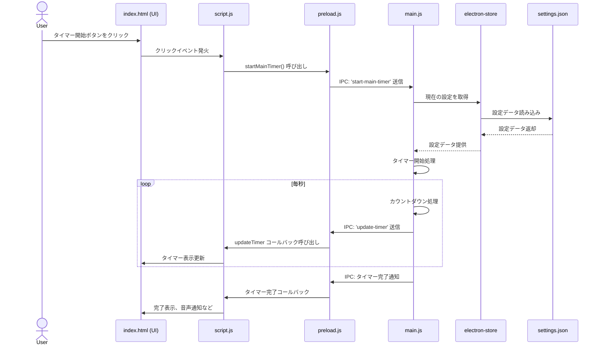

## アプリケーション構造

本 Focus Timer アプリケーションは Electron フレームワークを使用し、以下の主要コンポーネントで構成されています:

1. Main Process (main.js):
   - アプリケーションのコア機能を管理
   - ウィンドウの作成と制御
   - タイマーのロジック実装
   - 設定の保存と読み込み

2. Renderer Process (index.html, script.js, settings.js):
   - ユーザーインターフェースの表示と操作
   - タイマーの表示更新
   - 設定画面の操作

3. Preload Script (preload.js):
   - Main Process と Renderer Process 間の安全な通信を提供

4. 設定ストレージ (settings.json):
   - ユーザー設定の永続化

### ファイルの役割

1. main.js:
   - Electron アプリケーションのエントリーポイント
   - ウィンドウ管理、IPC 処理、タイマー機能実装、設定管理

2. preload.js:
   - セキュアな IPC 通信の実現
   - Renderer Process 用 API の定義

3. index.html:
   - アプリケーションの UI 構造定義
   - script.js と settings.js の読み込み

4. script.js:
   - メイン画面の UI 操作
   - タイマー表示の更新
   - ユーザーアクションの処理

5. settings.js:
   - 設定画面の UI 操作
   - 設定変更の処理と保存

6. settings.json:
   - ユーザー設定のストレージ

### データフロー

1. ユーザーアクション (例: タイマー開始)
2. Renderer Process (script.js) がアクションを検知
3. preload.js を介して Main Process に通信
4. Main Process (main.js) が処理を実行
5. 結果を preload.js を介して Renderer Process に返送
6. Renderer Process が UI を更新

### 設定の管理

1. 設定変更: 
   settings.js → preload.js → main.js → electron-store → settings.json

2. 設定読み込み:
   settings.json → electron-store → main.js → preload.js → Renderer Process

この構造により、セキュアで効率的なアプリケーション動作を実現しています。